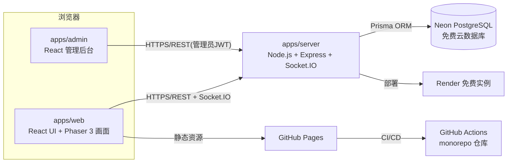

# 《冒险者酒馆》Adventurer's Tavern —— 游戏设计全案 v0.3

> 东方修仙题材 · 经营模拟为核心 · 大世界多人联机 · 开源 · 免费上线 GitHub
> v0.3 变更：新增师徒系统、兽潮守卫战（塔防）、随机秘境（爬塔）、寻宝罗盘、每日签到；商业化定为"免费 + 预留内购框架"；阶段 0 项目骨架已搭建。
> v0.2 变更：新增 23 个玩法系统（奇遇/订单/采集/PK/宗门/拍卖/境界/图鉴/灵宠/武道大会等），重构为"大世界 + 领地 + 多玩法"结构。

---

## 0. 项目概览

| 项目 | 内容 |
|---|---|
| 游戏名 | 《冒险者酒馆》Adventurer's Tavern（暂定，可改） |
| 类型 | 像素风修仙经营 + 大世界多人联机 + 自动战斗 + 野外自由 PK |
| 平台 | 网页浏览器（PC / 手机均可） |
| 核心 | 经营酒馆赚灵石 → 修境界提升实力 → 野外采集与自由 PK → 组队历练 → 交易竞技社交 |
| 世界结构 | 私有领地（安全）+ 坊市广场（安全，同屏）+ 野外大地图（同屏，自由 PK 区） |
| 账号 | 游客直接开玩 + 可选注册（数据无缝升级） |
| 技术栈 | React + Phaser 3 ／ Node.js + Express + Socket.IO ／ PostgreSQL (Neon) + Prisma |
| 部署 | GitHub Pages（前端+后台页面） + Render（后端） + Neon（数据库），GitHub Actions 自动部署 |
| 管理后台 | 用户/房间/统计/配置/公告/日志 + 世界BOSS调度 + 拍卖监控 + 宗门管理 + 红名监控 |
| 预算 | 每月 0 元（免费额度，升级路径见第 10 章） |
| 商业化 | 免费游玩 + 预留内购框架（仙玉/时装/加速道具，远期接支付，不影响游戏性） |

**实话实说：** 当前规划的内容量已接近一款中小型 MMORPG。单人开发完整版预计 12~24 个月业余时间；配合 AI 辅助编码可压到 6~12 个月。文档按"完整版目标、分阶段上线"组织，每个阶段结束都能部署给朋友玩。

---

## 1. 世界观与定位

**一句话设定：** 你是初入修仙界的凡人掌柜，接手山脚破落的「冒险者酒馆」。种灵田、酿灵酒、炼丹药，招待四方修士；走出酒馆，是广袤的修仙大陆——野外采药挖矿、与人斗法夺宝；攒够资源突破境界，从炼气一路修到渡劫飞升。

**三层世界结构：**

| 区域 | 属性 | 玩法 | 同屏 |
|---|---|---|---|
| 私有领地（酒馆/灵田） | 安全区 | 经营、装修、炼丹、接待顾客 | 房主 + 访客 |
| 坊市广场/城镇 | 安全区 | 交易、聊天、摆摊、小游戏、NPC | 分线 50 人/线 |
| 野外大地图（灵田秘境、矿脉、妖兽林…） | **自由 PK 区** | 采集、刷怪、世界BOSS、袭击其他玩家 | 分线 50 人/线 |

---

## 2. 核心玩法循环

### 2.1 经营循环（主线）

```
灵田/灵兽/野外采集 → 收获材料 → 烹饪/酿造/炼丹 → 顾客消费/订单/交易行
      ↑                                                          ↓
  装修扩建、解锁新内容 ← 灵石 ← 奇遇事件、任务板、真人顾客光顾
```

### 2.2 成长循环（境界为脊梁骨）

```
历练副本/野外刷怪/完成任务 → 获得修为 → 突破境界（炼气→筑基→金丹→元婴→化神→…）
      ↑                                                          ↓
  解锁新地图/新作物/新玩法 ← 战力与内容边界扩张 ← 装备/丹药/图鉴/成就
```

### 2.3 江湖循环（PK 与恩怨）

```
野外采集/杀怪夺宝 → 袭击他人或被袭击 → 红名/悬赏/掉落 → 接悬赏/复仇/宗门战
```

### 2.4 社交循环

```
真人顾客互相光顾 → 好友/结拜/结婚 → 宗门共建 → 世界BOSS/武道大会/节日活动
```

---

## 3. 系统总览与优先级

> ★ 数量 = 推荐开发优先级（结合你勾选的顺序：经营深度 → 野外PK生态 → 收集养成 → 剧情仪式感 → 社交多人）。

### 3.1 经营线（★★★）

| 系统 | 关键规则 |
|---|---|
| 灵田种植 / 灵兽养殖 | 成长时间制，好友浇水加速 |
| 烹饪 / 酿造 / **炼丹** | 材料配比 + 成功率；丹药增益经营与战斗；炼丹炉可升级 |
| 顾客系统 + **真人顾客** | NPC 修士按口碑消费；**玩家可互相光顾对方酒馆**，光顾提升双方口碑，留下足迹与打赏 |
| **委托任务板** | NPC 限时订单：指定菜品/材料，超时失败，奖励灵石修为 |
| **随机奇遇事件** | 灵田虫灾、仙门长老光顾、天降陨石、迷路修士求助……分支选择，奖励/惩罚随机 |
| **野外采集** | 钓鱼、挖矿、采药三个小游戏，产出经营与炼丹材料 |
| **季节与天气** | 春夏秋冬影响作物周期；雨天作物加速、雷雨触发稀有奇遇；节日限定内容 |
| **装修装扮** | 家具摆放、领地美观度评分、每月装扮大赛 |
| **兽潮守卫战** | 每周 2 次妖兽攻村，塔防：布置防御灵阵、雇佣守卫，守榜排行，失守掉落部分仓库资源（有保护上限） |

### 3.2 成长线（★★★）

| 系统 | 关键规则 |
|---|---|
| **修仙境界**（核心升级系统） | 炼气→筑基→金丹→元婴→化神→炼虚→合体→大乘→渡劫；突破需修为+材料+渡劫挑战；**每境界解锁新区域/作物/玩法；筑基后开启野外 PK**（防新手被杀） |
| **飞升转生** | 满级飞升，保留部分永久加成（灵根资质），重新开局更强 |
| 冒险者（英雄） | 招募、职业、星级、技能、装备强化/洗练 |
| 装备系统 | 强化、升星、洗练、灵石镶嵌，副本/野外/PK 掉落 |
| **主线剧情任务** | 酒馆前世今生、NPC 故事线，随境界推进解锁章节 |
| **图鉴收集** | 作物/菜谱/灵兽/冒险者/丹药/时装六类图鉴，收集度奖励 |
| **成就与称号** | 上百个成就；称号展示在头顶与聊天框 |

### 3.3 战斗线（★★）

| 系统 | 关键规则 |
|---|---|
| 组队副本 | 房间码组队，**自动战斗**，服务端结算掉落 |
| **随机秘境（爬塔）** | Roguelike：每层随机战斗/奇遇/商店/宝箱，随机 BUFF 与诅咒，每周重置结算周榜，服务端种子防改层数 |
| **野外自由 PK**（分区制） | 野外地图同屏可见；**发起袭击→双方自动战斗结算**（离线玩家由其冒险者自动应战）；胜者抢得对方背包部分采集物 |
| **红名与悬赏** | 主动杀人 +100 杀孽值，杀孽>0 为红名：**进不了安全区、被 NPC 卫兵追杀、可被任何人接悬赏令讨伐**；红名死亡掉落装备+背包资源；做善事/挂机时长洗白 |
| **世界 BOSS** | 定时刷新全服 BOSS，同屏或分线共同输出，按伤害排名发奖 |
| **武道大会** | 定期淘汰赛：报名→分组对战（自动战斗）→全服观战 + **灵石下注** |
| 竞技场（日常） | 异步切磋，积分段位，每日次数限制 |

### 3.4 社交线（★★）

| 系统 | 关键规则 |
|---|---|
| 好友 / 拜访 / 送礼 | 拜访领地、浇水、送礼物、好感度 |
| **师徒系统** | 相差 ≥2 境可结师徒（限 1 师 2 徒）：传功、护法、师徒任务、出师双赢奖励；同 IP/设备防小号刷 |
| **宗门帮会** | 玩家建宗门：宗门领地、宗门任务、宗门仓库、**宗门排行与宗门战**（以世界BOSS伤害榜+武道大会成绩结算） |
| **拍卖行** | 每周稀有物品拍卖会，全服竞价，一口价+延时竞拍 |
| **结婚/结拜** | 双人任务解锁；共同家园、专属互动动作、情侣/结拜称号与加成 |
| **节日活动** | 春节/中秋/端午等：限定作物、限定时装、限时副本、全服任务 |

### 3.5 趣味线（★）

| 系统 | 关键规则 |
|---|---|
| **酒馆小游戏** | 行酒令（猜拳博弈）、投壶（力度角度）、猜灯谜，玩家间对战赌灵石 |
| **灵宠养成与探险** | 灵宠跟随、喂养进化；**灵宠探险**：派灵宠定时寻宝带回材料 |
| **寻宝罗盘** | 每日 3 次，野外随机坐标挖宝，奖励随机档位（材料/灵石/稀有碎片） |
| **每日签到** | 7 天一轮，第 7 天大奖，漏签可花灵石补签 |

---

## 4. 关键新系统详细设计

### 4.1 修仙境界系统（核心升级线）

| 境界 | 大致等级段 | 解锁内容示例 |
|---|---|---|
| 炼气 | 1~10 | 基础作物、烹饪、坊市 |
| 筑基 | 11~20 | **野外地图与 PK 开放**、钓鱼采矿、组队副本一阶 |
| 金丹 | 21~30 | 炼丹炉、宗门、拍卖行 |
| 元婴 | 31~40 | 灵宠进化、世界BOSS、武道大会 |
| 化神 | 41~50 | 飞升系统开启、高阶副本、稀有时装 |
| 炼虚→渡劫 | 51~80 | 终局内容、跨服活动（远期） |

- **突破流程：** 攒修为 → 集齐突破材料（丹药+副本/野外掉落）→ 渡劫挑战（自动战斗）→ 成功晋升（全服公告）；
- 境界同时是**内容闸门**：新手在坊市安全成长，筑基出门闯江湖，天然的新手保护。

### 4.2 野外自由 PK（江湖生态）

```
野外地图（灵药谷/黑风矿脉/妖兽林，筑基以上可进入）
 ├─ 采集点 / 精英怪：产出绑定材料的核心资源
 ├─ 玩家同屏实时移动（复用广场技术）
 └─ 发起袭击 → 双方自动战斗结算（离线者由冒险者队伍自动应战）
       ├─ 胜：抢得对方背包 10%~30% 采集物
       └─ 主动袭击者：杀孽 +100
红名（杀孽 > 0）：
 ├─ 禁止进入坊市/安全区（卫兵追杀）
 ├─ 登上悬赏榜，任何玩家可接悬赏令讨伐
 ├─ 被击杀：掉落随机装备 + 背包资源，杀孽 -50
 └─ 洗白：杀孽随时间衰减 / 完成宗门善事任务
```

- **防滥杀：** 筑基以下不可被袭击；同一目标 30 分钟内不可重复袭击；宗门内不互袭；
- **收益平衡：** 野外采集物只占经营材料的 1/3，纯种田玩家不 PK 也能玩，但野外收益更高——风险换效率。

### 4.3 世界 BOSS

- 每日固定时段刷新（如 20:00），全服玩家在野外 BOSS 区域同屏/分线输出（自动战斗回合制结算）；
- 按伤害占比发奖励（灵石+修为+稀有材料），尾刀额外奖；
- 与宗门排行联动：宗门成员伤害总和计入宗门战成绩。

### 4.4 宗门帮会

| 功能 | 说明 |
|---|---|
| 建宗 | 金丹境界 + 灵石费用，自定宗门名与徽章 |
| 宗门领地 | 宗门大厅、仓库（成员捐献/借用）、宗门商店 |
| 宗门任务 | 每日贡献任务，贡献兑换宗门商店物品 |
| 宗门排行 | 按成员总战力+世界BOSS伤害+武道大会积分综合排名 |
| 宗门战 | 以周为周期：世界BOSS伤害 + 武道大会 + 野外击杀分结算 |

### 4.5 拍卖行

- 每周六晚 8 点拍卖会：系统上架稀有物品（时装/稀有灵宠/高阶装备图纸）；
- 规则：底价起拍，出价后 60 秒内无新出价则成交（延时竞拍防秒杀），全服同屏展示；
- 与交易行互补：日常物资走交易行，稀有物品走拍卖会。

### 4.6 结婚/结拜

- 双方好感度满 → 接结拜/婚礼任务（合力完成限时委托）→ 仪式（坊市广场举办，全服可围观送礼）；
- 权益：共同家园、专属互动动作、组队经验加成 5%、专属称号与图鉴。

### 4.7 武道大会

- 每周日：报名→按境界分组→单败淘汰（自动战斗，全服可观看）→ 冠军雕像立于坊市广场 + 灵石下注系统；
- 下注：观战玩家用灵石押注选手，庄家抽水 5%（另一条灵石回收线）。

### 4.8 酒馆小游戏

| 小游戏 | 玩法 | 赌注 |
|---|---|---|
| 行酒令 | 石头剪刀布变体三局两胜 | 灵石/佳酿 |
| 投壶 | 蓄力+角度投掷小游戏 | 灵石 |
| 猜灯谜 | 限时答题（题库配置在 `game_configs`） | 小额灵石 |

### 4.9 兽潮守卫战（塔防）

- 每周 2 次（周三/周六 21:00），妖兽潮攻击玩家领地；
- 防守手段：布置防御灵阵（消耗灵石/材料）、雇佣守卫（NPC 或好友冒险者助战）；
- 结算：守住获得灵石+材料+兽潮积分；失守掉落部分仓库资源（有保护上限）；
- 兽潮积分周榜，奖励灵石与称号「护庄大师」。

### 4.10 随机秘境（爬塔）

- 单人/组队进入，每层随机：战斗/奇遇/商店/宝箱；
- 层数越高敌人越强、奖励越好；每周重置并结算周榜；
- 随机 BUFF（本轮属性加成）与诅咒，肉鸽式构筑乐趣；
- 服务端生成种子并结算每层，防止客户端改层数。

### 4.11 师徒系统

- 境界相差 ≥2 境（如金丹收炼气）可结师徒，每人限 1 师 2 徒；
- 传功：师父消耗自身修为转化为徒弟经验（转化率 80%），每日限 1 次；
- 护法：徒弟渡劫时师父可助阵提高成功率；
- 出师：徒弟达到师父境界 -1 可出师，双方各得灵石+仙玉+称号；
- 防小号刷：同一 IP/设备关联的师徒不发奖励。

### 4.12 寻宝罗盘与每日签到

- 每日签到：7 天一轮，第 7 天大奖（仙玉/稀有材料），漏签可花灵石补签；
- 寻宝罗盘：每日 3 次，消耗罗盘（签到/任务获得），野外随机坐标挖宝，奖励分档位随机。

### 4.13 内购框架预留（远期）

- 原则：**内购不影响游戏性**——只卖仙玉、时装、加速道具，绝不卖战力碾压；
- 数据层先建表：`products`（商品/价格/类型）、`orders`（订单/状态/幂等键）；
- 支付渠道未来可选：Stripe / Lemon Squeezy / 爱发电码，服务端回调验签后发货；
- 上线初期只开放"免费 + 捐赠入口"（爱发电/ko-fi 链接），游戏内不出现购买按钮。

---

## 5. 数值与经济系统

### 5.1 货币

| 货币 | 获取 | 用途 | 流通 |
|---|---|---|---|
| 灵石 | 经营、任务、历练、野外、PK 抢夺 | 升级、交易、拍卖、下注 | 玩家间流通 |
| 仙玉 | 成就、赛季、活动、武道大会 | 系统商店稀有品、时装 | 不可交易 |
| 宗门贡献 | 宗门任务、捐献 | 宗门商店 | 宗门内 |

### 5.2 关键数值（全部入 `game_configs`，后台热改）

| 参数 | 初值 | 参数 | 初值 |
|---|---|---|---|
| 体力上限/恢复 | 100 / 5分钟1点 | PK 抢夺比例 | 背包采集物 10%~30% |
| 作物周期 | 10分钟~24小时 | 杀孽衰减 | 1点/小时 |
| 交易税 | 5% | 拍卖延时 | 60 秒 |
| 炼丹成功率 | 基础 60%，配方浮动 | 武道大会下注抽水 | 5% |
| 世界BOSS | 每日 20:00 | 赛季时长 | 4 周 |

### 5.3 防通胀五板斧

建筑升级费、装备修理费、交易税 5%、拍卖/下注抽水 5%、PK 掉落与红名惩罚（高风险玩家的自然消耗）。

---

## 6. 技术架构

### 6.1 总体架构



### 6.2 选型（同 v0.1）

React 18 + Vite + Zustand + Phaser 3 ｜ Node.js + Express + Socket.IO ｜ Prisma + PostgreSQL (Neon) ｜ Zod ｜ i18next ｜ Ant Design。

### 6.3 场景技术方案（三种同屏场景复用一套引擎）

| 场景 | 人数 | 同步要点 |
|---|---|---|
| 坊市广场 | 50/线 | 10Hz 视野广播（15×15 格） |
| 野外大地图 | 50/线 | 同上 + 袭击确认弹窗 + 战斗切入动画 |
| 领地（私有） | 房主+访客≤5 | 按需加载，无访客时不占服务器内存 |
| 世界BOSS/拍卖会/武道大会 | 分线+共享数据 | 伤害榜/竞价/赛程存数据库，画面分线渲染 |

### 6.4 服务器权威原则

客户端只发意图（种/收/袭击/出价/下注），所有结算在服务端完成并写库；关键操作幂等键防重复；交易/拍卖/下注独立限流。

### 6.5 仓库结构

```
adventurers-tavern/
├── .github/workflows/        # CI/CD
├── apps/
│   ├── web/                  # 游戏前端
│   ├── server/               # 游戏后端
│   └── admin/                # 管理后台
├── packages/
│   ├── shared/               # 类型、Socket 事件、Zod schema、配置
│   └── database/             # Prisma schema 与迁移
├── docs/                     # 设计文档、素材署名 CREDITS.md
└── pnpm-workspace.yaml / turbo.json
```

---

## 7. 数据库设计（PostgreSQL）

### 7.1 表清单（v0.2 新增 26 张，共 50+ 张）

| 分组 | 表 | 用途 |
|---|---|---|
| 账号 | `users` / `sessions` | 游客+注册统一账号、会话 |
| 玩家 | `players` | 主档：灵石/仙玉/体力/**境界**/杀孽值/口碑/美观度 |
| 境界 | `realm_defs` / `breakthrough_logs` | 境界定义（配置）、渡劫记录 |
| 领地 | `buildings` / `farm_plots` / `livestock` / `placed_furniture` | 建筑、灵田、灵兽、装修摆放 |
| 经营 | `item_defs` / `player_inventory` / `equipments` | 物品、背包、装备 |
| 经营 | `recipe_defs` / `cooking_orders` / `alchemy_orders` | 菜谱、烹饪队列、炼丹队列 |
| 经营 | `quest_defs` / `player_quests` | 委托任务板 |
| 经营 | `event_defs` / `event_logs` | 奇遇事件定义与触发记录 |
| 世界 | `wild_zones` / `collection_spots` / `seasons` / `weather_states` | 野外区、采集点、季节天气 |
| 战斗 | `heroes` / `parties` / `party_members` / `dungeon_defs` / `battle_logs` | 冒险者、组队、副本、结算 |
| PK | `kill_logs` / `bounty_board` / `red_name_logs` | 击杀记录、悬赏榜、杀孽流水 |
| BOSS | `world_bosses` / `boss_events` / `boss_damage_ranks` | BOSS 定义、场次、伤害榜 |
| 交易 | `market_listings` / `market_trades` / `auctions` / `auction_bids` | 交易行、拍卖会 |
| 竞技 | `arena_matches` / `arena_ranks` / `tournaments` / `tournament_brackets` / `tournament_bets` | 竞技场、武道大会 |
| 社交 | `friends` / `visits` / `gifts` / `couples` / `sects` / `sect_members` / `sect_contributions` | 好友、拜访、结婚结拜、宗门 |
| 收集 | `codex_entries` / `achievement_defs` / `player_achievements` / `titles` / `fashion_items` / `pets` / `pet_expeditions` | 图鉴、成就、称号、时装、灵宠 |
| 剧情 | `story_nodes` / `player_story_progress` | 主线剧情节点与进度 |
| 玩法 | `beast_tides` / `defense_logs` | 兽潮场次与防守结算 |
| 玩法 | `tower_defs` / `tower_runs` | 随机秘境定义与爬塔记录 |
| 社交 | `mentor_relations` | 师徒关系、传功与护法记录 |
| 运营 | `daily_checkins` / `treasure_hunts` | 每日签到、寻宝罗盘 |
| 商业化(远期) | `products` / `orders` | 内购商品与订单，接入支付后启用 |
| 趣味 | `minigame_matches` | 小游戏对局 |
| 运营 | `announcements` / `mails` / `gift_codes` / `festival_defs` | 公告、邮件、礼包码、节日活动 |
| 配置 | `game_configs` | 全部数值参数（后台热改） |
| 后台 | `admin_users` / `admin_logs` / `bans` | 管理员、审计日志、封禁 |

### 7.2 关键表字段示例

**players**（核心字段）

| 字段 | 类型 | 说明 |
|---|---|---|
| id / user_id | uuid | 主键 / 关联账号 |
| nickname / avatar | text | 昵称、形象 |
| level / exp / realm | int / bigint / text | 等级、经验、**当前境界** |
| stones / jades | bigint | 灵石 / 仙玉 |
| energy / energy_updated_at | int / timestamptz | 体力 |
| kill_score（杀孽） | int | PK 值，>0 为红名 |
| fame / beauty_score | int | 口碑、美观度 |
| sect_id / couple_id | uuid 可空 | 宗门、伴侣 |
| last_plaza_line / last_wild_line | int | 所在分线 |

**kill_logs**（PK 流水，含掉落快照）

| 字段 | 类型 | 说明 |
|---|---|---|
| id | uuid PK | |
| attacker_id / victim_id | uuid FK | 袭击者 / 受害者 |
| zone_id / battle_log_id | text / uuid | 地点、战斗记录 |
| loot_snapshot | jsonb | 被抢夺物品清单 |
| victim_was_red | boolean | 是否悬赏讨伐 |
| created_at | timestamptz | |

**auctions**

| 字段 | 类型 | 说明 |
|---|---|---|
| id / item_id | uuid / text | 拍卖品 |
| base_price / current_price | bigint | 底价、当前价 |
| highest_bidder_id | uuid 可空 | 最高出价者 |
| ends_at / extended_at | timestamptz | 成交时间（每次出价顺延 60 秒） |
| status | enum(pending/live/sold) | |

**sects**

| 字段 | 类型 | 说明 |
|---|---|---|
| id / name / emblem | uuid / text / text | 宗门 |
| leader_id | uuid FK | 宗主 |
| level / funds / warehouse_json | int / bigint / jsonb | 等级、资金、仓库 |
| weekly_score | bigint | 宗门战周积分 |

---

## 8. 管理后台设计（apps/admin）

| 页面 | 功能 |
|---|---|
| 登录 / 权限 | 管理员账号，超级管理员/运营两级 |
| 仪表盘 | 在线峰值、活跃、注册、对局、交易额、**红名数量、今日 PK 次数** |
| 用户管理 | 搜索、详情（背包/灵石/装备/境界）、封禁/解封、重置昵称 |
| 房间/对局监控 | 广场与野外各分线人数、组队房间、副本与 **PK 流水** |
| 悬赏与红名监控 | 红名榜、悬赏榜、异常 PK 检测（如 1 小时袭击 20 次） |
| 世界 BOSS 调度 | BOSS 定义/刷新时间/血量/掉落表配置，手动开启场次 |
| 拍卖会管理 | 上架拍卖品、监控竞价、异常出价冻结 |
| 宗门管理 | 宗门列表、解散、改周积分、处理违规宗门 |
| 兽潮与秘境调度 | 兽潮时间/难度/奖励配置；随机秘境层数与周榜结算 |
| 内购订单（远期） | 商品配置、订单查询、退款处理（接入支付后再启用） |
| 数据统计 | 排行榜快照、留存、产出/消耗报表、灵石流入流出审计 |
| 参数配置 | `game_configs` 可视化热改（数值/掉落/事件概率/题库） |
| 公告与活动 | 全服公告、邮件、礼包码、节日活动开关与配置 |
| 审计日志 | 管理员全部操作留痕 |

---

## 9. 安全与反作弊清单

1. 服务端权威结算；客户端不存关键数值；
2. JWT + 游客设备指纹；全接口限流，交易/拍卖/下注/袭击独立低频限流；
3. 输入 Zod 校验；Prisma 参数化查询；
4. **PK 滥用防护：** 同目标 30 分钟冷却、境界门槛、杀孽衰减慢、红名惩罚重、异常击杀频率自动告警；
5. 经济审计：灵石/物品异常增量检测脚本，告警到后台；
6. 管理员敏感操作二次确认 + 全量审计日志。

---

## 10. 部署方案（每月 0 元）

| 组件 | 平台 | 免费额度（以官网为准） | 备注 |
|---|---|---|---|
| 前端+后台页面 | GitHub Pages | 公开仓库免费，约 100GB/月带宽 | 纯静态 |
| 后端 API + WebSocket | Render Free | 750 实例小时/月，512MB | 无流量 15 分钟休眠，冷启动约 1 分钟 |
| 数据库 | Neon Free | 约 0.5GB + 月约 190 计算小时 | 开发期与几十名玩家足够 |

**注意事项：**
- Render 休眠：登录页放"服务器唤醒中"提示；可加定时保活（灰色做法，量力而行）；
- 人多了升级：Render $7/月，或 **Oracle Cloud 永久免费 VPS**（4 核 24G，注册需信用卡、常缺货）自托管 Docker；
- 世界BOSS/拍卖会集中时段会推高瞬时连接，免费实例约可承载 50~100 人同屏分线，超了再升配。

**CI/CD：** push main → 类型检查+测试 → 构建 web/admin 发布 Pages → 构建 server 部署 Render；密钥全存 GitHub Secrets / Render 环境变量。

---

## 11. 开发路线图（完整版目标，14 个阶段，每阶段可上线）

> 排序按你勾选的优先级：经营深度 → 野外 PK 生态 → 收集养成 → 剧情仪式感 → 社交多人（基础设施提前穿插）。

| 阶段 | 内容 | 验收标准 |
|---|---|---|
| 0 骨架 | monorepo、CI/CD、Pages/Render/Neon 打通 | push 后自动上线"Hello 酒馆"并连上数据库 |
| 1 经营核心 | 游客进入、灵田种植收获、建筑升级、烹饪售卖 | 完整走通"种→收→卖→升级" |
| 2 账号存档 | 注册登录、游客转正、JWT、多端同步 | 换设备数据一致 |
| 3 经营深度 ★ | **境界系统（炼气~金丹）、委托任务板、随机奇遇事件、季节天气** | 突破有仪式感；订单与奇遇打破单调 |
| 4 顾客与社交雏形 | NPC 顾客、口碑、好友、拜访浇水 | 好友能来你的领地帮忙 |
| 5 公共广场 | 坊市同屏、移动、聊天、摆摊、小游戏（猜灯谜） | 双浏览器窗口互见互聊 |
| 6 野外生态 ★ | **野外地图、采集（钓鱼/挖矿/采药）、自由 PK、红名悬赏、掉落** | 野外能采集、能袭击、红名被悬赏 |
| 7 战斗引擎 | 冒险者、装备强化、组队副本、自动战斗结算 | 组队打完副本各自领掉落 |
| 8 收集线 ★ | **图鉴、成就称号、灵宠养成与探险、时装外观、寻宝罗盘、每日签到** | 收集进度可视化，灵宠能探险寻宝 |
| 9 经济闭环 | 交易行、**拍卖行**、炼丹系统、装修系统 | 挂单成交账目一致；拍卖会延时竞拍 |
| 10 仪式感 ★ | **主线剧情、结婚/结拜、节日活动、武道大会、兽潮守卫战、随机秘境** | 婚礼可围观；武道大会可下注；兽潮可防守 |
| 11 社交多人 ★ | **真人顾客、世界BOSS、宗门帮会、师徒系统** | 世界BOSS按时刷新发奖；宗门可建可排行 |
| 12 后台完善 | 管理后台全功能、异常检测、审计日志 | 后台能封人/改配置/调BOSS/监控红名 |
| 13 打磨上线 | 数值平衡、多语言预留、性能优化、公开测试 | 正式公测，素材署名齐全 |

**时间参考：** 单人业余 12~24 个月；AI 辅助 6~12 个月。阶段 0~3 是前 1/4 路程，跑通后每阶段都有肉眼可见的新玩法。

---

## 12. 素材与资源方案

| 类型 | 来源 | 说明 |
|---|---|---|
| 通用像素 | Kenney（CC0） | 农场/建筑/UI 基础 |
| 角色 | LPC（CC-BY-SA/GPL） | 四方向行走帧 |
| 古风场景 | itch.io "pixel chinese / asian tileset" | 青瓦竹林山石；**先用通用素材搭玩法，后期统一换皮** |
| 中文像素字 | Zpix（免费商用） | 界面与聊天 |
| 音乐音效 | OpenGameArt / freesound / itch.io free BGM | 搜 "oriental / guzheng" |
| 图标 | Lucide / game-icons.net | UI 与物品图标 |

素材许可全部记录进 `docs/CREDITS.md`，游戏"关于"页署名。

---

## 13. 待定清单（不阻塞开发）

1. 全部具体数值表（作物/菜谱/丹药/装备词条/副本掉落/事件概率）；
2. 冒险者职业与技能（剑修/丹师/阵师/御兽……）；
3. 野外地图数量与主题（灵药谷/黑风矿脉/妖兽林……）；
4. 宗门战计分细则、武道大会分组规则；
5. 开源协议（建议 MIT 代码 + CC 素材分开声明）；
6. 玩家社区（QQ 群/Discord）与预约页；
7. 是否加邮箱验证、找回密码（用户多了再补）；
8. 内购商品与定价（远期，接入支付时再定）。

---

*文档版本：v0.3 · 阶段 0（项目骨架）已搭建，见 adventurers-tavern/ 目录。*
